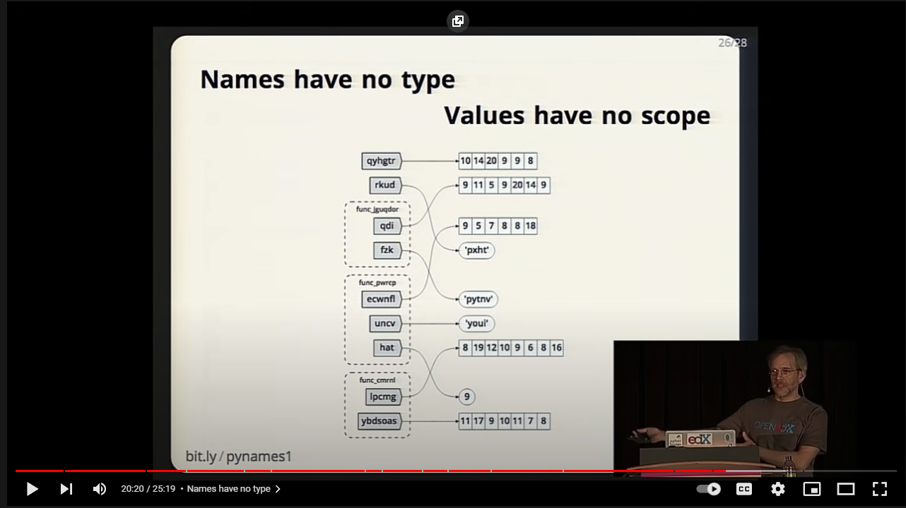

# Read: Class 01

## To Finish those 2 years in 10 weeks you will pay the price of pain... but its not a Normal Pain , its the type of pain you love and you will request it from time to time since it will stimulate your brain cells and neurons

>Dont Confuse Pain with Suffering

### Keep Reminding  your Self in the Next 10 Weeks

    - What’s your perspective?
    - Why are you doing this?
    - Do you want what comes at the end of this journey?
    - Are you doing this for you?

>### As you experience pain, seek the remedy

---

>### Remeber You Not Just Here to be a competent Python Dev. You are here to be a superb Craftsman and Python is Your tool

---
---

# A beginner's guide to Big-O Notation By ROB BELL

> It Descirbes the Performance or complexity of an algorithm so understanding it Allows you to make the correct choices and acknowledge trade-offs when working with different data sets.

## Good Code

- Readability
- Scalable (Big O)

----

# Ned Batchelder - Facts and Myths about Python names and values - PyCon 2015

## [check the video](https://www.youtube.com/watch?v=_AEJHKGk9ns)

>### python is simple, it Works like any other languages, Until it doesn`t

>= equal sign is very dangerous!!!

1. Assignment (=) never copies data!; in other words Make Names refer to value !

2. Python is neither "Call By value" nor "Call By Reference", it's "Call by Assignment"! Epic!

3. There is no way in python where a name can refer to another name. A name can only refer to values.\

4. immutable values can`t alias ; int,float,Strings,tuples

---

### [Python 3 Module of the Week](https://pymotw.com/3/index.html)
