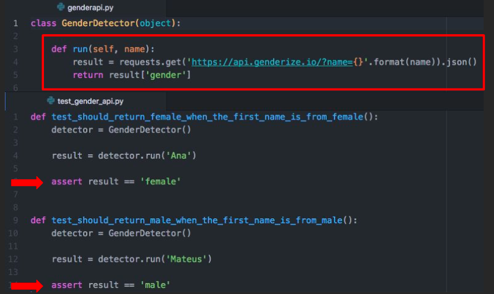

# Read: Class 02

>For the future check Testing and refactoring !?

## What are unit tests?
    They are an exercise or a training for your code. 
    Remeber You can write them anytime you want!

## what is TDD ?
    its stands for Tes - Driven Development; and its a strategy to think and write, Tests first ;)

## **The First Step of TDD is:**
    1. baby Steps... which includes :

        a. What is the smaller test that we can do against a function?
        example : 
        def test_should_return_female_when_the_name_is_from_female_gender():
    detector = GenderDetector()
    expected_gender = detector.run(‘Ana’)
    assert expected_gender == ‘female’

        b. Pay attention to small details! firstly is Test Name... because your test name can be considered as your alive documentation.

        c. The test file name should follow the same name of module name
            example : if our module is `gender.py`, our test name should be `test_gender.py`
        d. It’s ideal to separate the tests folder from production code (the implementation)

    2. care about structure {remeber the Triple A convention :Arrange, Act and Assert.}
        a. Arrange : organize the data needed
        b. Act : execute the code
        c. Assert : check if the result (output) is the same as you were expecting.
> Hint ! Pytest is a good lib for testing

## **The cycle**
    The Cycle is made up by three steps:
        a. 🆘 Write a unit test and make it fail (it needs to fail because the feature isn’t there, right? If this test passes, call the Ghostbusters, really)
        b. ✅ Write the feature and make the test pass! (you can dance after that)
        c. 🔵 Refactor the code — the first version doesn’t need to be the beautiful one (don’t be shy)

    >>Using baby steps you can go through this cycle every time you add or modify a new feature in your code.

## **TDD is not about the money/tests**
    One of the Amazing things about TD is how you can grow your software design consciously and well , Just building what is needed ti make the test Pass!!.
    Devs tend to think about the design first and how they can break in to small pieces or Small Steps!

Final Example :
    def test_should_return_male_when_the_name_is_from_male_gender():
    detector = GenderDetector()
    expected_gender = detector.run(‘Pedro’)
    assert expected_gender == ‘male’
___
    import requests

    def run(self, name):
    result = requests.get('https://api.genderize.io/?name{}'.format(name))
    return result['gender']

>To Sum Up! :
    - The greatest advantage about TDD is to craft the software design first
    -Your code will be more reliable: after a change you can run your tests and be in peace
    - Beginning may be hard ...and that’s fine. You just need to practice!
___
___
# What does the if __name__ == “__main__”: do?
> Remeber its a module not a script

    - Since we Took on Lab1 That python doesnt need to export functions like in JS... All you have to do in python is import the function on your required file ...  but when testing what you will actually see is the function will execute even if its not called on the requsted file so to avoid that ... 
    we use if __name__ == “__main__” ; 
    - What it will actually do is the indent lines wont run if they were called from other files!!

>Advantages : 

    1. Every Python module has it’s __name__ defined and if this is ‘__main__’, it implies that the module is being run standalone by the user and we can do corresponding appropriate actions.
    2. If you import this script as a module in another script, the __name__ is set to the name of the script/module.
    3. Python files can act as either reusable modules, or as standalone programs.
    4. if __name__ == “main”: is used to execute some code only if the file was run directly, and not imported.
    
[check this link to learn more export functions](https://www.geeksforgeeks.org/what-does-the-if-__name__-__main__-do/)
___
___
# **Recursion and the famous fibonaci!**
[check this link to learn more abot recursion](https://www.geeksforgeeks.org/recursion/)
>What is Recursion? 

    its the process of the function calling itself [directly or indireclty ]
___
>example A Mathematical Interpretation :
>>determine the sum of first n natural numbers?

    approach(1) – Simply adding one by one
    f(n) = 1 + 2 + 3 +……..+ n
___
    approach(2) – Recursive adding 
    f(n) = 1                  n=1
    f(n) = n + f(n-1)    n>1
>There is a simple difference between the approach (1) and approach(2) and that is in approach(2) the function “ f( ) ” itself is being called inside the function, so this phenomenon is named as recursion and the function containing recursion is called recursive function

>Always remeber what is the base condition?!
>>In the recursive program, the solution to the base case is provided and the solution of the bigger problem is expressed in terms of smaller problems.

    example :

    int fact(int n)
    {
    if (n < = 1) // base case
        return 1;
    else    
        return n*fact(n-1);    
    }
___

>Why Stack Overflow error occurs in recursion? 
>>If the base case is not reached or not defined, then the stack overflow problem may arise. Let us take an example to understand this.

    exanple :

    int fact(int n)
    {
    // wrong base case (it may cause
    // stack overflow).
    if (n == 100) 
        return 1;

    else
        return n*fact(n-1);
    }

    # A Python 3 program to
    # demonstrate working of
    # recursion

    def printFun(test):
    if (test < 1):
        return
    else:
        print(test, end=" ")
        printFun(test-1)  # statement 2
        print(test, end=" ")
        return

    # Driver Code
    test = 3
    printFun(test)
 
    # This code is contributed by
    # Smitha Dinesh Semwal

>output:

    3 2 1 1 2 3 